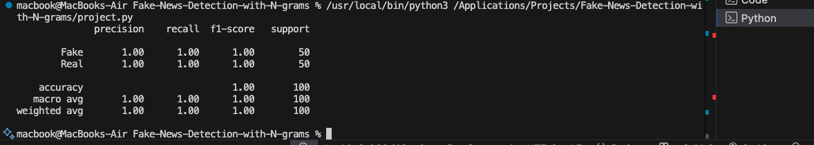

# Fake-News-Detection-with-N-grams

This project demonstrates how to detect fake and real news statements using Natural Language Processing (NLP) and the Multinomial Naive Bayes classifier.  
The dataset is synthetic and contains 500 news headlines — 250 labeled as Fake and 250 as Real — created for demonstration purposes.

ngram range (1,2) result
